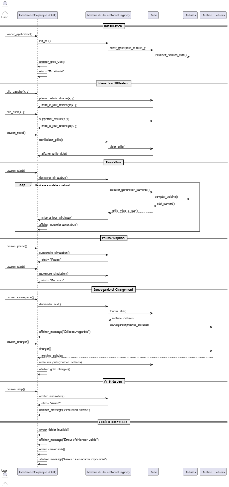

## **Livrable – Documentation des Schémas Fonctionnels et Dynamiques du Jeu de la Vie**

### 1. **Présentation générale**

Ce livrable décrit deux représentations complémentaires du système « Jeu de la Vie » :

* **Un Diagramme d'activité**, illustrant le **traitement logique de chaque cellule** selon les règles du jeu.
* **Un diagramme de séquence**, représentant la **dynamique des échanges** entre les différents composants logiciels et l’utilisateur.

---

### 2. **Diagramme d'activité**

####  **Description générale**

L’organigramme illustre le **processus décisionnel appliqué à chaque cellule** du tableau.
Chaque itération correspond à l’évaluation de l’état d’une cellule (vivante ou morte) en fonction du nombre de ses **voisines vivantes**.

####  **Principaux éléments du schéma**

1. **Vérification initiale du tableau (`Tab != 0`)**

   * Si le tableau n’existe pas ou est vide, un **message d’erreur** est affiché.
   * Sinon, le traitement des cellules commence.

2. **Boucle de parcours (`i = 0 → NombreDeCase`)**

   * Chaque cellule est analysée individuellement à chaque génération.

3. **Condition principale – État de la cellule (`Case == 1`)**

   * Si la cellule est **vivante**, on vérifie le nombre de voisines vivantes :

     * Si **2 ≤ CasesVivantesAdjacentes < 4**, la cellule **survit**.
     * Sinon, elle **meurt** (sous-population ou surpopulation).
   * Si la cellule est **morte**, elle **renaît** si elle a **exactement 3 voisines vivantes**.

4. **Mise à jour du tableau**

   * Une fois toutes les cellules traitées, la grille mise à jour est affichée.

####  **Utilité**

* Décrit la **logique métier** du moteur de simulation.
* Sert de **base à l’implémentation** du calcul de génération suivante.
* Permet de **valider les conditions et les transitions** d’état dans le code.

#### **Ce que cela représente**

* La **partie algorithmique** du jeu.
* Le **fonctionnement interne** d’une itération de simulation.
* Les **règles de vie et de mort** des cellules selon Conway.

---

### 3. **Diagramme de Séquence – Comportement global du système**

#### **Description générale**

Ce diagramme montre les **interactions temporelles** entre l’utilisateur, l’interface graphique (GUI), le moteur de jeu, la grille de cellules, et la gestion des fichiers.
Il détaille le **cycle de vie complet du jeu**, depuis l’initialisation jusqu’à l’arrêt, en passant par la simulation, la sauvegarde et le chargement.

####  **Principales séquences**

1. **Initialisation**

   * L’utilisateur lance l’application.
   * Le moteur crée la grille et initialise les cellules vides.
   * L’interface affiche la grille initiale.

2. **Interaction utilisateur**

   * L’utilisateur peut **ajouter** ou **supprimer** des cellules (clic gauche/droit).
   * Il peut aussi **réinitialiser** la grille.

3. **Simulation**

   * Lors du démarrage, une boucle calcule en continu les générations suivantes :

     * Comptage des voisines.
     * Application des règles (selon l’organigramme précédent).
     * Mise à jour et affichage.

4. **Pause et reprise**

   * La simulation peut être **mise en pause** et **reprise**, tout en conservant l’état courant.

5. **Sauvegarde et chargement**

   * L’état de la grille peut être sauvegardé dans un fichier via le module `FileIO`.
   * Un état précédemment sauvegardé peut être rechargé.

6. **Arrêt du jeu**

   * L’utilisateur peut arrêter la simulation à tout moment.

7. **Gestion des erreurs**

   * Messages d’erreur en cas de fichier invalide ou de sauvegarde impossible.

####  **Utilité**

* Sert de **référence pour le développement des interactions entre composants**.
* Permet d’identifier **les rôles et responsabilités** de chaque module.
* Aide à la **communication entre les équipes** (développeurs, testeurs, concepteurs UI).

####  **Ce que cela représente**

* La **logique de communication entre les modules**.
* Le **comportement dynamique** du système au fil du temps.
* La **structure fonctionnelle globale** du jeu.

---

### 4. **Complémentarité des deux schémas**

| Aspect                   | Organigramme                           | Diagramme de Séquence                                      |
| ------------------------ | -------------------------------------- | ---------------------------------------------------------- |
| **Nature**               | Logique interne / algorithmique        | Dynamique / communication                                  |
| **Perspective**          | Moteur de calcul (niveau bas)          | Architecture système (niveau haut)                         |
| **Objectif**             | Définir les règles de vie des cellules | Décrire les interactions entre l’utilisateur et le système |
| **Public cible**         | Développeurs algorithmiques            | Développeurs front/back et architectes                     |
| **Type de modélisation** | Fonctionnelle                          | Comportementale (UML)                                      |

---

### 5. **Conclusion**

Ces deux diagrammes forment une **documentation technique complète** du système :

* L’organigramme garantit la **validité logique** du traitement des cellules.
* Le diagramme de séquence UML assure la **cohérence des interactions** entre les composants du jeu.

Ensemble, ils facilitent :

* La **compréhension du code source** avant développement.
* La **maintenance** et l’**évolution** du projet.
* La **communication claire** entre les membres de l’équipe.

---